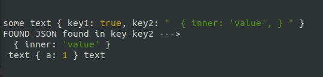

# log-parsed-json

[](https://github.com/marketplace/actions/super-linter)


Pretty prints JSON like objects found in the string passed to it.

Recursively dumps JSON objects found inside other JSON objects, even if they are overly stringified.

As well as regular stringified JSON, it copes with much of the output from util.inspect() for standard JSON-like data objects, including circular references.

Escaped quotes as used in Kibana logs are handled. E.g. `{\"@metadata\": \"value\"}`

Intended to help with debugging, particulary in situations where you have for example Kibana logs containing JSON within JSON.

## Automatic Repairs to JSON

-   Change Python None to null
-   Change Python True and False to true and false
-   Insert missing commas between key-value pairs
-   Insert missing commas between array elements
-   Remove trailing commas
-   Add quotes to keys
-   Convert single quotes, backticks, curly quotes, escaped double quotes and double escaped double quotes to double quotes
-   Merge strings concatenated with a `+` to a single string
-   Remove additional double quote at start of key that gpt-3.5-turbo sometimes adds
-   Escape unescaped newline `\n` in string value
-   Deal with many escaping la-la land cases e.g. `{\"res\": \"{ \\\"a\\\": \\\"b\\\" }\"}`

## Aggressive Repairs

-   Mode to attempt to repair mismatched quotes as output by quantised llama3

## Installation

```bash
npm install log-parsed-json
```

## Find and handle the JSON output from Large Language Models

Sometimes large language models output JSON like strings, but with a few quirks.
This can happen with gpt-3.5-turbo and gpt-4 for example.

```javascript
const { firstJson } = require('log-parsed-json');

const completion = `Thought: "I need to search for developer jobs in London"
Action: SearchTool
ActionInput: { location: "London", 'title': "developer" }
`;

console.log(firstJson(completion));
```

Gives output

```json
{ "location": "London", "title": "developer" }
```

## Enable aggressive handling of quotes

```javascript
const { firstJson } = require('log-parsed-json');

const completion = `A JSON parser! { name: "Alice', ”age': 26 }
`;

console.log(firstJson(completion, { attemptRepairOfMismatchedQuotes: true }));
```

Gives output

```json
{ "name": "Alice", "age": 26 }
```

## Usage - pretty printing JSONs found within a string

```javascript
const { log } = require('log-parsed-json');

log(`some text { key1: true, 'key2': "  { inner: 'value', } " } text { a: 1 } text`);
```

Result



## Usage - parsing a JSON like string into JSON.parse() friendly format

util.inspect()'s output is not JSON.parse() friendly.

```javascript
const { repairJson } = require('log-parsed-json');

console.log(repairJson(`{ 'k1': 'v1', 'k2': 123 }`));
```

Result

```txt
{ "k1": "v1", "k2": 123 }
```

Mentions of circular are just turned into a string, and any refs within the object are removed.

```javascript
console.log(repairJson("{ a: 'somestring', b: 42, e: { c: 82, d: [Circular *1] } }"));
```

Result

```txt
{ "a": "somestring", "b": 42, "e": { "c": 82, "d": ["Circular"] } }
```

## Usage - parsing a string to an array of plain strings or JSON.parse() compatible strings

```javascript
const { toArrayOfPlainStringsOrJson } = require('log-parsed-json');

console.log(toArrayOfPlainStringsOrJson(`text { 'k1': 'v1', 'k2': 123 } text { a: 1 } text`));
```

Result

```txt
[
  'text ',
  '{ "k1": "v1", "k2": 123 }',
  ' text ',
  '{ "a": 1 }',
  ' text'
]
```

## Usage - canParseJson

Returns true or false based on if `repairJson()` would return a valid JSON string.

```javascript
const { canParseJson } = require('log-parsed-json');

console.log(canParseJson(`{ 'k1': 'v1', k2: 123 }`));
console.log(canParseJson(`{ 'k1': "v1", "k2": 123 }`));
console.log(canParseJson(`"test"`));
console.log(canParseJson(123));
console.log(canParseJson(true));
```

Result

```json
true
true
false
false
false
```

Let's write a function and compare the response from `JSON.parse()` for the same scenarios.

```javascript
function isJSON(str) {
    try {
        JSON.parse(str);
    } catch (e) {
        return false;
    }
    return true;
}

console.log(isJSON(`{ 'k1': 'v1', k2: 123 }`));
console.log(isJSON(`{ 'k1': "v1", "k2": 123 }`));
console.log(isJSON(`"test"`));
console.log(isJSON(123));
console.log(isJSON(true));
```

Result

```json
false
false
true
true
true
```

## Usage - firstJson

Returns the first JSON object found in the string.

```javascript
const { firstJson } = require('log-parsed-json');

console.log(firstJson(`text { 'k1': 'v1', 'k2': 123 } text { a: 1 } text`));
```

Result

```json
{ "k1": "v1", "k2": 123 }
```

## Usage - lastJson

Returns the last JSON object found in the string.

```javascript
const { lastJson } = require('log-parsed-json');

console.log(lastJson(`text { 'k1': 'v1', 'k2': 123 } text { a: 1 } text`));
```

Result

```json
{ "a": 1 }
```

## Usage - largestJson

Returns the largest JSON object found in the string.

```javascript
const { largestJson } = require('log-parsed-json');

console.log(largestJson(`text { 'k1': 'v1', 'k2': 123 } text { a: 1 } text`));
```

Result

```json
{ "k1": "v1", "k2": 123 }
```

## Usage - jsonMatching

Returns the first JSON object found in the string that matches the given regular expression.

```javascript
const { jsonMatching } = require('log-parsed-json');

console.log(jsonMatching(`text { 'k1': 'v1', 'k2': 123 } text { a: 1 } text`, /a: 1/));
```

Result

```json
{ "a": 1 }
```

## Usage - pretty print JSONs piped to `pretty`

To enable this, install `log-parsed-json` globally

```bash
npm install -g log-parsed-json
```

Now you can pipe to `pretty`

```bash
echo abc { a: 2 } abc | pretty

curl 'https://jsonplaceholder.typicode.com/todos/1' | pretty
```

## See also

Python version of this project: [https://pypi.org/project/fix-busted-json/](https://pypi.org/project/fix-busted-json/)
